# Hi 👋, I'm Ha Gia Linh
I'm a **Full Stack Developer** who enjoys building modern web applications, scalable APIs, and practical software solutions.

I mainly work with **React, Next.js, TypeScript, Java, Spring Boot, Node.js, and Express**.

## 🚀 About Me

* 💻 Full Stack Developer
* 🌐 Building modern applications with **React / Next.js / TypeScript / React Native / Jetpack Compose**
* ⚙️ Developing backend services with **Java / Spring Boot** and **Node.js / Express**
* 🗄️ Working with **PostgreSQL, MySQL, MongoDB, and SQLite**
* 🏗️ Interested in clean architecture, system design, API development, and real-time applications
* 📚 Always learning and improving my software engineering skills

## 🛠️ Languages & Tools

  

## 🔥 What I Build

* Full Stack Web/Mobile Applications
* RESTful APIs
* Real-time Applications
* Authentication & Authorization Systems
* E-commerce Platforms
* Financial & Trading Applications
* Developer Tools
* Blockchain & Web3 Experiments

## 📊 GitHub Stats

  
  

## 🔥 Contribution Streak

  

## 📫 Connect With Me

  
  

